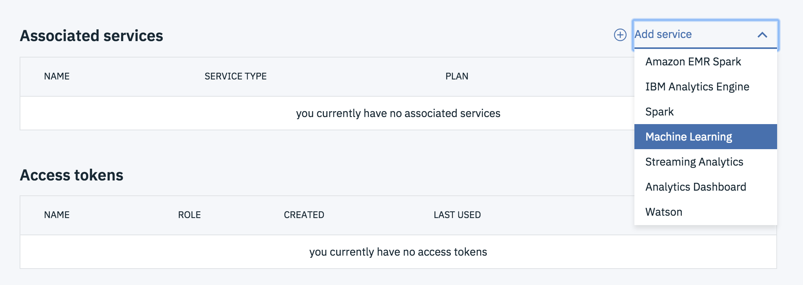
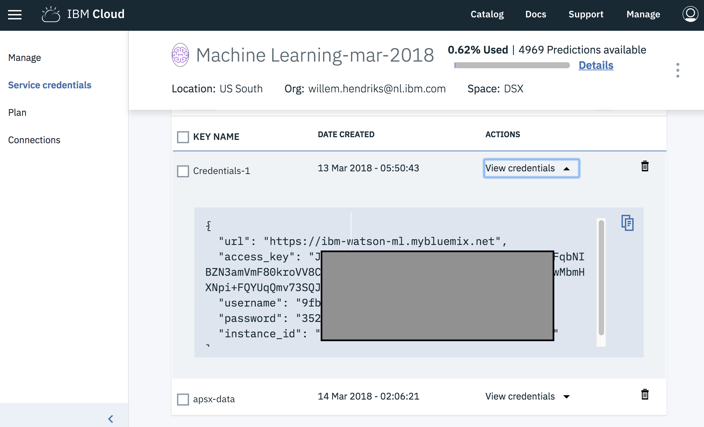
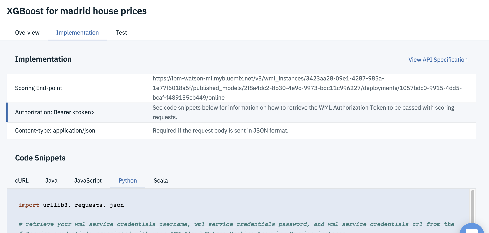

# Minimalistic example for how to deploy a model and create a Flask webapp

## 1 - Create a Model in Watson Studio and Deploy

Create a New Project - Make sure to add a Machine Learning service in the Project Settings.



Notebook contains example of a deployment, using Madrid Housing Data. Inside the notebook you need to copy/paste your Machine Learning Service credentials. Go to the Machine Learning Service from  https://console.bluemix.net/ 
to find your credentials.



## 2 - Create a Flask Webapp which uses the online model to score on data points

Using the Implementation code snippet, and a little python (Flask) code, we can create a small working example. The Flask framework is considered lightweight and easy to learn. http://flask.pocoo.org/



`IBM_CLOUD_APP` contains a Flask webapp. To run locally;

Install the requirements
```
pip3 install -r requirements.txt
```

Edit `app.py` and
1. Make sure the credentials are the exact same from step **1**
2. Check the `scoring_endpoint` to match the URL like in the Code Snippit.

Run the webapp
```
python3 app.py
```

The website should run on port 5000.

## 3 (Optional) - Deploy the Flask Webapp in the IBM Cloud

### Install IBM CLoud CLI

I did the following inside a Ubuntu docker - but it has install options for the most common OS. 

https://docs.cloudfoundry.org/cf-cli/install-go-cli.html
(Use a Package Manager)

### Edit the manifest.yml to point it to a different hostname

I have claimed `watsonstudiodeployment`, so you have to change it to something else
```
  name: watsonstudiodeployment
  host: watsonstudiodeployment
```

### Deploy on the IBM Cloud

Endpoint: `https://api.ng.bluemix.net`

Login and deploy the application

```
cf login --sso
cf push
```

After some waiting you should see

```
App started


OK

App watsonstudiodeployment was started using this command `python app.py`

Showing health and status for app watsonstudiodeployment in org willem.hendriks@nl.ibm.com / space dev as willem.hendriks@nl.ibm.com...
OK

requested state: started
instances: 1/1
usage: 512M x 1 instances
urls: watsonstudiodeployment.mybluemix.net
last uploaded: Tue May 15 09:06:00 UTC 2018
stack: cflinuxfs2
buildpack: python_buildpack

     state     since                    cpu    memory        disk           details
#0   running   2018-05-15 09:07:57 AM   4.0%   19M of 512M   307M of 512M
root@5ee889adcd68:/wml/IBM_CLOUD_APP# 

```

See a example running on http://watsonstudiodeployment.mybluemix.net/
